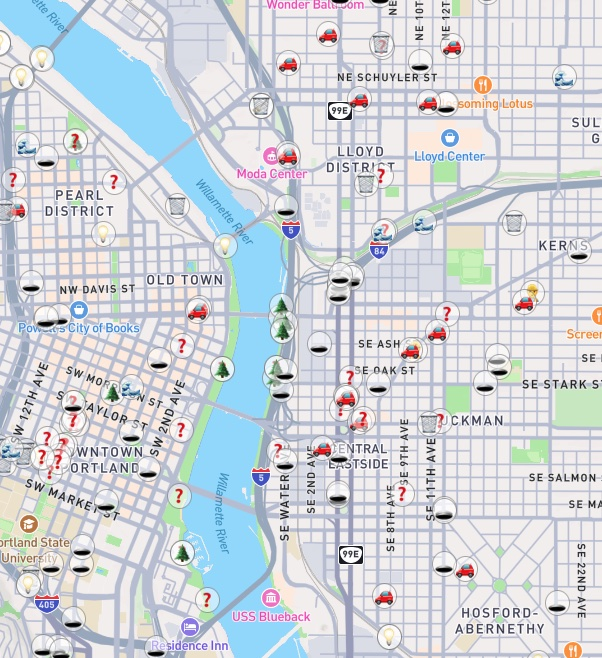

# pdxreporter-map

Map for PDX Reporter using WebhookDB.

Check out the map using [dynamic filters](https://webhookdb.github.io/pdxreporter-map) or a [single query](https://webhookdb.github.io/pdxreporter-map).

This code was built for the tutorial at <https://docs.webhookdb.com/guides/render-map/>.



## Demo

Check out <https://webhookdb.github.io/pdxreporter-map> for a version using dynamic filters (status, category) and <https://webhookdb.github.io/pdxreporter-map/simple> for a version using a single [saved query](https://docs.webhookdb.com/docs/integrating/saved-queries.html).

## Development

It's just an HTML file. You'll need to serve it from localhost so the Mapbox token works.

    $ python3 -m http.server

Then open a browser to <http://localhost:8000> or <http://localhost:8000/simple> and the map will load.

Contributions on map styling are welcome and do not require anything beyond a browser and text editor.

If you want to modify the SQL query that powers these maps,
you can set up your own WebhookDB account and point it at your own feed.

```
# See https://docs.webhookdb.com/docs/getting-started/install-cli.html
$ brew install webhookdb/webhookdb-cli/webhookdb
$ webhookdb auth login
$ webhookdb integrations create atom_single_feed_v1
```
